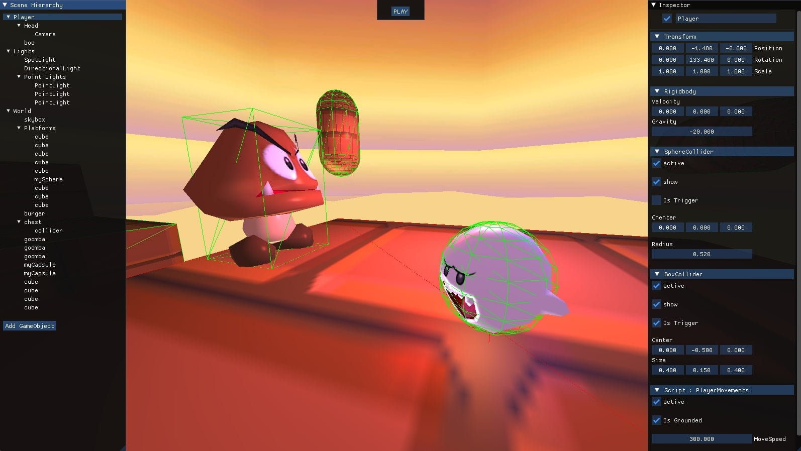
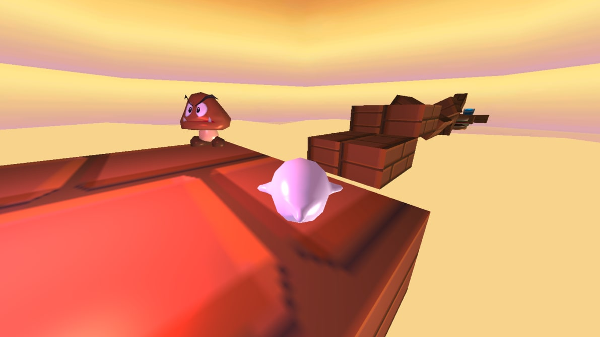

# EngineGL

## Project Description:

<br>

This project involves the creation of a **3D video game engine** in C++ using **OpenGL**, but also the development of a simple platformer game with 3D physics using this game engine.

<br />

## Preview:




<br />

## Features:

**Resource Manager**
- Textures
- Meshes
- Shaders

**Lights**
- Directional light
- Point light
- Spot light

**Scene Graph**
- GameObjects (Parent - Children)
- Components (models, colliders, scripts...)

**User Interface** (Editor Mode)
<ul>
<li>Scene hierarchy
<ul>
<li>Add/Delete gameobject nodes
</ul>
<li>Inspector 
<ul>
<li>Displays editable properties of selected gameobject
<li>Displays editable components of selected gameobject
<li>Add/Delete components
</ul>
<li>Play Button (start game) 
</ul>

**3D Collisions**
- Box Collider
- Sphere Collider
- Capsule Collider

**Options Menu**
- Edit game keybinds

<br />

## Controls:
**Play Mode**
- Move → ```WASD``` (editable in options)
- Jump → ```Space``` (editable in options)
- Show/Hide colliders → ```C```
- Back to Menu → ```ESCAPE```

**Editor Mode**
- Free camera mode → ```Mouse Wheel Button```
- Camera's movements → ```WASD```, ```SPACE```, ```LEFT SHIFT```
- Show GameObject's inspector → ```Left Mouse Button``` on GameObjects nodes (In Scene Hierarchy)
- Add Child to GameObject → ```Right Mouse Button``` on GameObjects nodes (In Scene Hierarchy)
- Start Play Mode → ```PLAY```  (Top-screen button)
- Quit → ```ESCAPE```

<br />
<hr />

Authors : **Matias Héno** & **Laurent Lin**

For [ISART Digital](https://www.isart.com)

<hr />